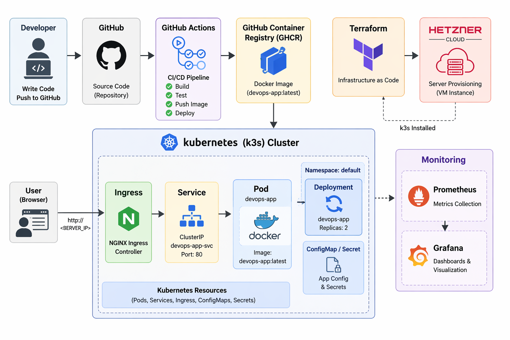
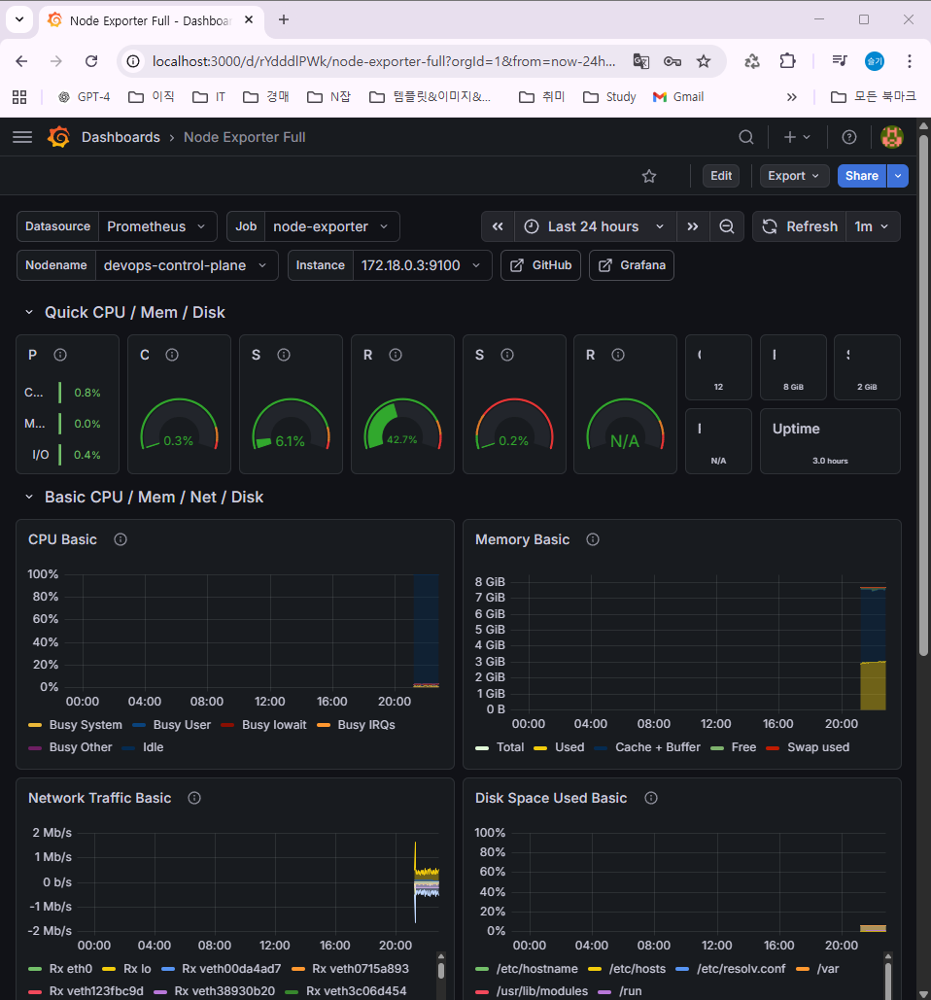

# Cloud Native DevOps Project
---
## Live Demo
> https://seulgichoi.dev

---

## Goal
Design and operate a production-like cloud-native environment using containers, Infrastructure as Code, and CI/CD automation.

---

## Tech Stack
- WSL2 (Ubuntu)
- Git & GitHub
- Docker
- Kubernetes
- Terraform
- GitHub Actions

---

## Project Structure
cloud-native-devops-gcp/
├── app/ # Node.js application (API + DB connection)
│ ├── server.js
│ ├── package.json
│ └── index.html
│
├── docker/ # Docker configuration
│ └── Dockerfile
│
├── k8s/ # Kubernetes manifests (deployment, service, ingress)
│ ├── deployment.yaml
│ ├── service.yaml
│ ├── ingress.yaml
│ └── postgres-*.yaml
│
├── terraform/ # Infrastructure as Code (Hetzner Cloud)
│ ├── main.tf
│ ├── variables.tf
│ └── outputs.tf
│
├── docs/ # Architecture diagrams
│ ├── architecture.png
│ └── monitoring.png
│
├── .github/workflows/ # CI/CD pipelines
│ ├── ci.yml
│ └── deploy.yml
│
└── README.md

---

## Architecture

End-to-end DevOps architecture including CI/CD, container registry, Kubernetes cluster, and monitoring.
 
This project demonstrates a complete DevOps workflow:
Developer → GitHub → CI/CD → Docker Image → Kubernetes → Application  
Infrastructure is provisioned using Terraform on Hetzner Cloud.

---

## CI/CD
GitHub Actions is used for automation.

- On push → Docker image is built  
- Image is pushed to GHCR  
- Kubernetes deployment is updated  

Workflow files:
- .github/workflows/ci.yml
- .github/workflows/deploy.yml

---

## Deploy (Production)

Infrastructure is created using Terraform.

```bash
cd terraform
terraform init
terraform apply

terraform output  

ssh root@<SERVER_IP>  

curl -sfL https://get.k3s.io | sh -  

kubectl apply -f k8s/  
```
---

## Access

Application is exposed via Kubernetes Ingress.

> https://seulgichoi.dev

---

## Run Locally

kubectl apply -f k8s/  
kubectl port-forward svc/devops-app 8080:80  

Access:
http://localhost:8080/health  

---

## Monitoring
 
Prometheus and Grafana are used to monitor cluster and application metrics.

- CPU / Memory usage  
- Network traffic  
- Disk usage  



---

## Troubleshooting

Terraform provider permission error:
rm -rf .terraform  
rm .terraform.lock.hcl  
terraform init  

SSH host key changed:
ssh-keygen -f "~/.ssh/known_hosts" -R "<SERVER_IP>"  

---

## Backlog

- [x] Create application  
- [x] Dockerize application  
- [x] Deploy to Kubernetes  
- [x] Add CI/CD pipeline  
- [x] Configure Ingress  
- [x] Add monitoring (Prometheus / Grafana)  
- [x] Provision infrastructure with Terraform  

